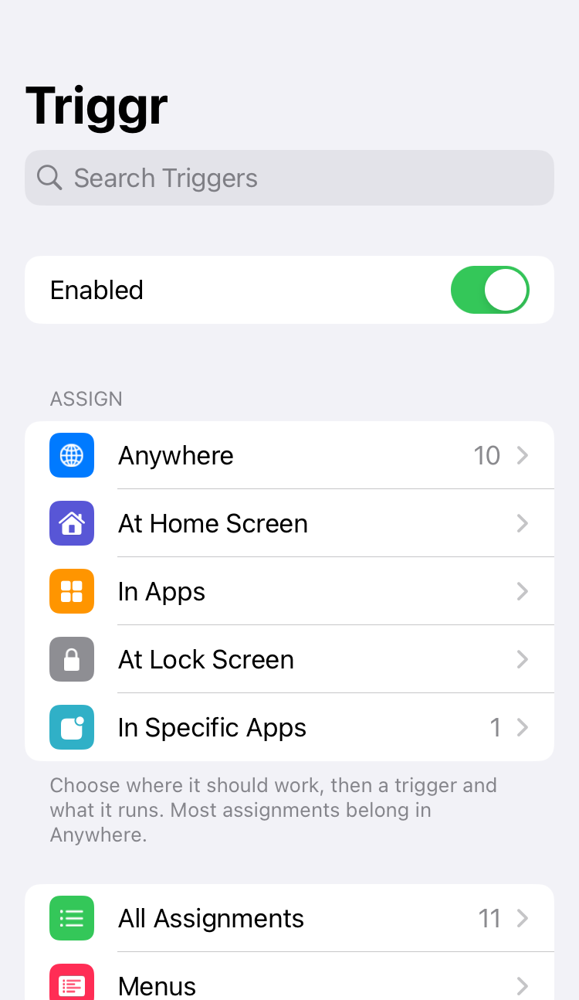
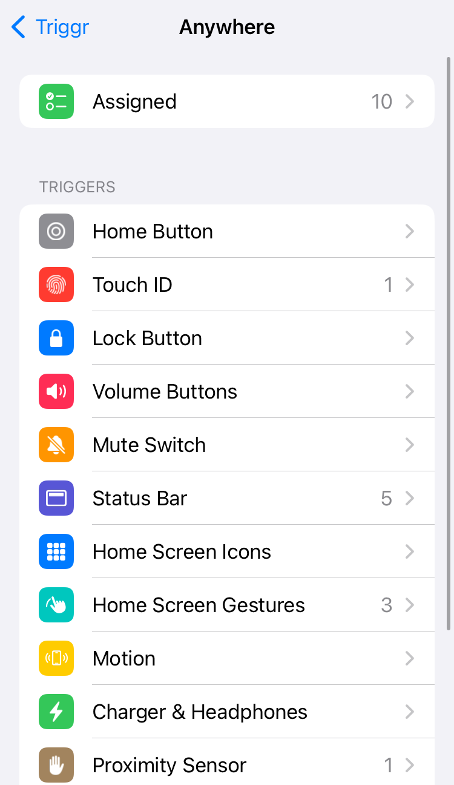
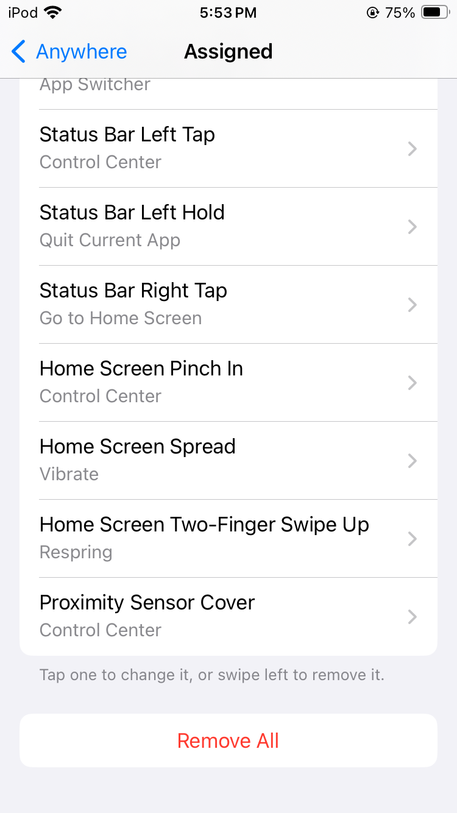
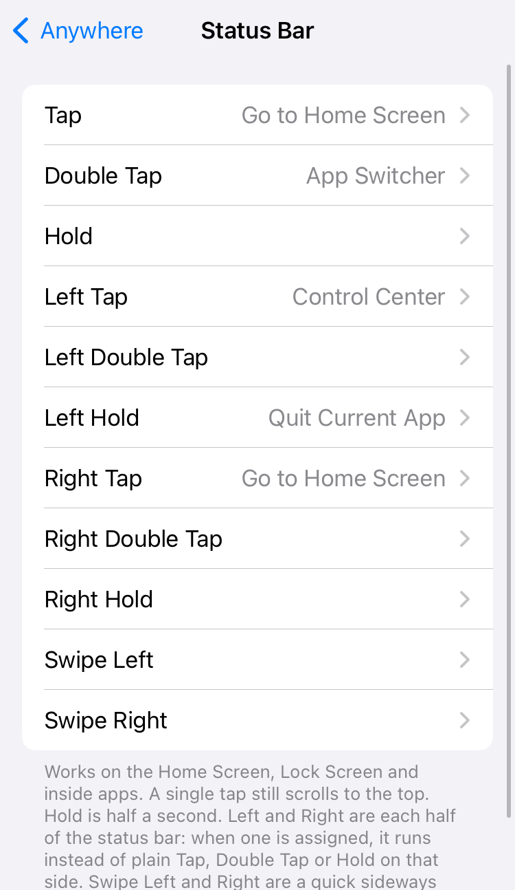
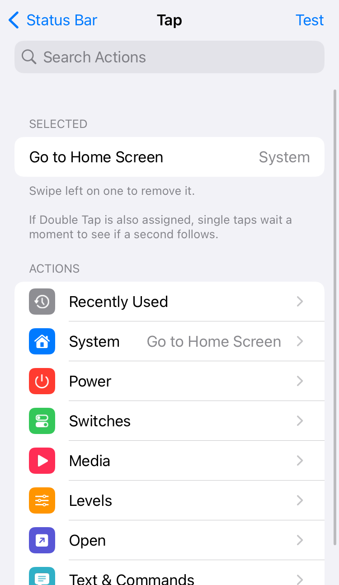
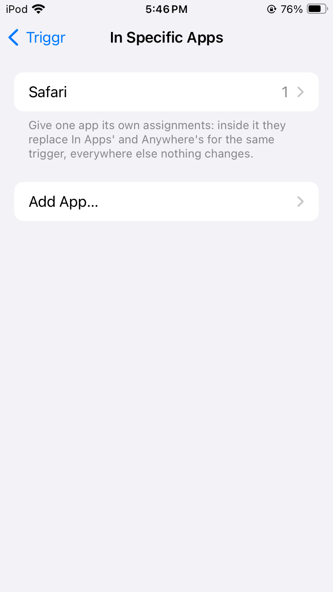
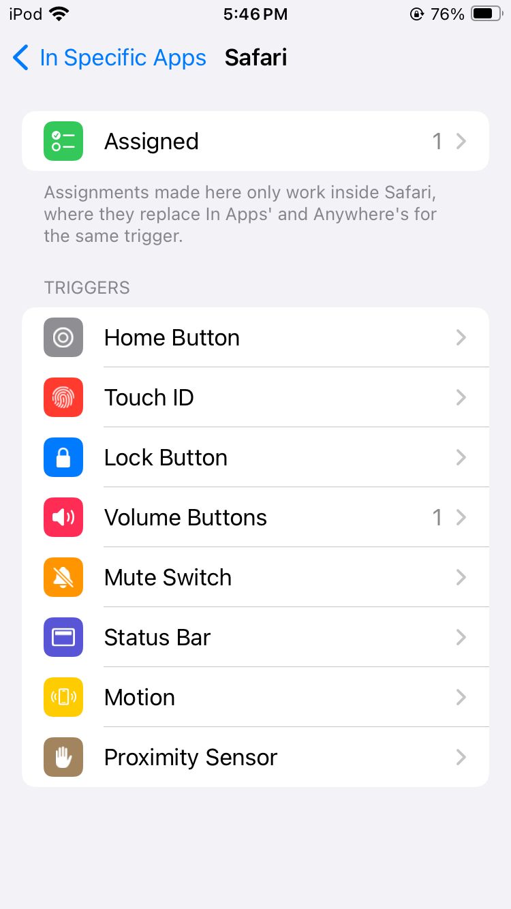
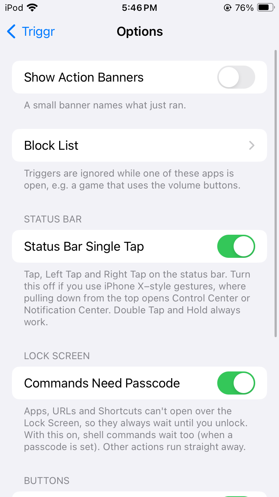

<h1 align="center">Triggr</h1>

<p align="center">
  <b>Activator-style triggers for modern jailbreaks.</b><br>
  Rootless Dopamine · iOS 15–18 · arm64 & arm64e · Touch ID and Face ID
</p>

<p align="center">
  <a href="https://jond-ie.github.io/repo/"></a>
  <a href="LICENSE"></a>
  
</p>

Press, tap, flick, pinch, shake or wave, and Triggr runs what you picked: go
Home, toggle the flashlight, open an app, run a Shortcut or a whole sequence of
actions. Assign it once in **Settings → Triggr** or the **Triggr app**, and it
works where you want it: everywhere, on the Home Screen, in apps, on the Lock
Screen, or inside one specific app.

<p>
  
  
  
  
  
  
  
  
</p>

## Why Triggr

- **Lightweight.** The main library loads into SpringBoard only. Apps get a tiny
  relay that links nothing but UIKit and stays silent unless a status bar or
  shake trigger is assigned. There's no web server and no polling; the small
  helper that runs commands on iOS 18 sleeps until one is needed.
- **Efficient by design.** Every hook checks the set of assigned triggers first
  and returns at once if its trigger isn't used. Event observers, timers, gesture
  recognizers, the proximity sensor and the API only exist while something is
  assigned to them. Settings changes arrive by notification; nothing is polled.
- **Private and safe.** Nothing listens on the network. The optional API is local,
  off by default, and can only run your own assignments, menus and built-in
  actions. Commands only ever run what's in your own setup. Notification triggers
  see which app posted, never what it says.
- **Made for today's iOS.** Tested on iOS 15, 16, 17 and 18, on A10 to A13, Touch
  ID and Face ID. On Face ID iPhones the side button is fully supported, including
  replacing Wallet and the Accessibility Shortcut, and commands keep working on
  iOS 18, where SpringBoard can no longer start programs itself.
- **Familiar.** Laid out like Activator: places, triggers and an action picker,
  with search, Recently Used and a Test button on top.
- **Respectful of iOS.** Unassigned buttons do exactly what they always did,
  waking the phone always works, and Emergency SOS is never touched.
- **Extensible.** Other packages can add their own actions with a single plist
  ([EXTENSIONS.md](EXTENSIONS.md)), like EQELinker's EQE presets.
- **Open source** under GPL-3.0.

## Install

1. Add **https://jond-ie.github.io/repo/** to Sileo or Zebra (or open the link on
   your device and tap **Add to Sileo** / **Add to Zebra**).
2. Install **Triggr**. AltList and PreferenceLoader come with it.
3. Respring, then open **Triggr** from your Home Screen or **Settings → Triggr**.

## Features at a glance

| | |
|---|---|
| **Buttons** | Home (single, double, triple, short / long hold), Lock / Side (single, double, triple, hold), Volume (presses, holds, sequences, both), Mute switch, Touch ID |
| **Status bar** | Tap, double tap, hold, each also per left / right half; swipe left / right |
| **Home Screen** | Icon flicks (per app too), pinch, spread, two-finger swipes, double tap on empty space |
| **Sensors** | Shake, proximity cover and wave |
| **Events** | Charger, headphones, Wi-Fi, Bluetooth, Low Power, lock / unlock, screen on / off, a specific network or device, battery level, an app opened, a notification from an app, a time of day |
| **Actions** | System and power actions, 14 switches (toggle / on / off), media and AirPlay, brightness and volume levels, open apps, Settings pages, Shortcuts and URLs, messages, speech, shell commands, menus, extensions |
| **Places** | Anywhere, At Home Screen, In Apps, At Lock Screen, In Specific Apps |
| **Extras** | Sequences with pauses, menus, profiles, export / import, block list, action banners, local API and `triggr` command |

## Tested devices

Triggr supports every arm64 and arm64e iPhone and iPad on iOS 15–18 with a
rootless jailbreak (Dopamine). It has been tested on:

| Chip | Architecture | Buttons | iOS |
|---|---|---|---|
| A10 | arm64 | Home button / Touch ID | 15.8.6 |
| A11 | arm64 | Home button / Touch ID | 16.7 |
| A13 | arm64e | Home button / Touch ID | 17.5.1 |
| A13 | arm64e | Face ID | 18.6.2 |

On Face ID devices the Home button and Touch ID groups are hidden and the lock
button is the **Side Button**. If anything ever lands you in safe mode, uninstall
Triggr from your package manager and please [report it](../../issues/new/choose).

## Documentation

### Getting around

- **Main page:** Enabled, the places, In Specific Apps, All Assignments, Menus,
  Options and Profiles & Sharing. The search field finds any trigger.
- **A place:** an **Assigned** row (tap to change, swipe to remove, or Remove
  All), then one row per kind of trigger. A place's assignment replaces
  Anywhere's for the same trigger.
- **In Specific Apps:** inside the chosen app its assignments replace In Apps' and
  Anywhere's; everywhere else nothing changes.
- **The action picker:** what's picked on top, then Recently Used and the
  categories, a search field, and **Test** to run it right away.
- The **Triggr app** shows the same pages as Settings.

### Triggers

| Group | Triggers | Behaviour |
|---|---|---|
| Home Button | Single, Double, Triple, Short Hold, Long Hold | Replaces the system press when assigned (see **Replace Button Actions**). If Triple is assigned, a double press waits 0.35 s. |
| Touch ID | Light Double Tap; Finger Rest, Finger Match (Lock Screen) | Light Double Tap replaces Reachability; Finger Rest and Match run alongside unlocking. |
| Lock / Side Button | Single, Double, Triple, Hold | See **Lock button** below. On Face ID devices an assigned Double or Triple Press replaces Wallet / Apple Pay or the Accessibility Shortcut. |
| Volume Buttons | Up, Down, Up Hold, Down Hold, Up then Down, Down then Up, Press Both, Hold Both | A press replaces the volume step; a hold fires after 0.5 s. |
| Mute Switch | Silent, Ring, Toggled | Replaces muting / unmuting when assigned. |
| Status Bar | Tap, Double Tap, Hold; Left / Right Tap, Double Tap, Hold; Swipe Left, Swipe Right | Home Screen, Lock Screen and in apps. Left and Right are each half of the bar and run instead of the plain trigger on that side. Single taps can be turned off (**Options → Status Bar Single Tap**); they're off by default on Face ID iPhones, where a tap at the top can start pulling down Control Center. Swiping down stays iOS's. |
| Home Screen Icons | Flick Up, Down, Left, Right | A quick flick that starts on an app or folder icon. |
| Home Screen Gestures | Pinch In, Spread, Two-Finger Swipe Up / Down, Double Tap Empty Space | On the Home Screen pages; one-finger scrolling, Spotlight and icons work as before. Ignored while editing or with a folder open. |
| Motion | Shake Device | iOS's own shake detection: no sensor runs for Triggr. |
| Proximity Sensor | Cover, Wave | The sensor stays on only while one is assigned and the screen is on. |
| Charger & Headphones | Charger, Headphones connected / disconnected | Observed only while assigned. |
| State Changes | Wi-Fi, Bluetooth, Low Power on / off; joined / left a network; Device Locked / Unlocked; Screen On / Off | Changes Triggr causes itself are ignored for a second, so assignments can't loop. |
| Custom Events | A specific Wi-Fi network, a specific Bluetooth device (connected / disconnected), battery above / below X %, an app opened, **a notification from an app**, a scheduled time, a flick on one app's icon | Networks and devices are picked from your saved ones. Notifications only count which app posted, never what it says. |

### Actions

- **System:** Go to Home Screen, App Switcher, Last App, Quit Current App, Control
  Center, Notification Center, Spotlight, Reachability, Siri, Take Screenshot,
  Screen Recording (start / stop, like Control Center's button), Close Background Apps
  (clears the App Switcher except the app you're in and the one playing audio),
  Vibrate, and Do Nothing (takes a trigger away from iOS without running anything).
- **Power:** Sleep (a lock button press: the screen turns off and the phone
  locks, as the button does), Lock Device (locks but leaves the screen on), Respring,
  Power Off Slider, Safe Mode, Restart, Power Off. Safe Mode restarts SpringBoard through ElleKit's own Safe Mode (no tweaks,
  Triggr included) until it's left from the Safe Mode screen. Restart and Power
  Off act at once, without asking, and the jailbreak stays off until Dopamine is
  run again; the picker warns before adding any of these.
- **Switches** (Toggle / Turn On / Turn Off): Flashlight, Wi-Fi, Bluetooth, Airplane
  Mode, Cellular Data, Do Not Disturb, Low Power Mode, Rotation Lock, Mute, Dark
  Mode, Night Shift, Auto-Brightness, Keep Screen Awake (until the next respring),
  Location Services.
- **Media:** Play/Pause, Next, Previous, Volume Up, Volume Down, AirPlay Picker (the system
  AirPlay menu), Play on iPhone, and AirPlay To… (a speaker or TV picked from the ones on
  your network, or typed; Settings asks SpringBoard to find them).
- **Levels:** Brightness %, Media Volume %, Ringer Volume %.
- **Open:** an app, a Settings page, a Shortcut, a URL.
- **Text & Commands:** Show Message, Speak Text, Run Command
  (`/var/jb/bin/sh -c` as **mobile**, with an explicit PATH; see **triggrd** below).
- **Menus:** a pop-up list of actions to choose from (Triggr → Menus).
- **Extensions:** other packages can add their own category of actions (see
  [EXTENSIONS.md](EXTENSIONS.md)); for example EQELinker adds "EQE Presets".
- **Recently Used** keeps your last six picked actions one tap away, and the
  **Test** button (top right) runs what's picked right away.

Tick several actions to run them in order. **Order & Pauses** reorders them and
adds pauses between them. Tap an action there to add a pause after it. Pauses
left dangling after an action is removed are cleared automatically. Adding an
action that conflicts with the list shows a warning: something after Respring,
Toggle and On/Off for the same switch, or two full-screen panels without a pause.
If a switch is the only action picked, picking another of its options (say Toggle
after Flashlight On) replaces it instead.

### Replace Button Actions

**Options → Replace Button Actions** (on by default) decides what an assigned
button press does to the button's own action:

- **On:** it runs instead, like Activator: an assigned Home press doesn't go Home,
  an assigned volume press doesn't change the volume, an assigned lock press
  doesn't lock, an assigned mute switch flip doesn't mute. To keep the button's
  own action as well, add the matching action to the list (Go to Home Screen,
  App Switcher, Siri, Reachability, Volume Up / Down, Sleep, Power Off Slider,
  Mute On / Off).
- **Off:** every press reaches iOS untouched and Triggr's actions run alongside.

Touch ID Finger Rest / Match, volume holds and Up then Down always run alongside.

### Lock button

With Replace Button Actions on, the lock / side button works like Activator's:

- An assigned **Single Press** runs instead of locking. When Double or Triple
  Press is assigned too, presses wait 0.4 s after the last one to be counted.
- An assigned **Hold** runs instead of the power-off slider (or Siri).
- A count with nothing assigned is handed back to iOS: it still locks, opens
  Wallet or runs the Accessibility Shortcut.
- A press that starts on a dark screen always just wakes the phone.
- Four or more presses are never acted on, so Emergency SOS keeps working.

### Lock Screen

Apps, URLs, Shortcuts and Settings pages can't open over the Lock Screen, so they
wait until you unlock. iOS's own unlock action block
(`SBLockScreenManager setUnlockActionBlock:`) runs them once you authenticate. With
**Commands Need Passcode** on (the default), shell commands wait too when a
passcode is set.

### triggrd

On iOS 18 SpringBoard isn't allowed to start programs, so Run Command and
extension actions are handed to **triggrd**, a small daemon (running as mobile)
installed with Triggr. It only runs commands and extension actions that are in
your own assignments or menus. On iOS 15–17 SpringBoard starts them itself.

### Extras

- **Profiles & Sharing:**
  - Save your setup as a profile and switch between profiles.
  - **Export** a setup as a `.json` file (share sheet), or **Import** one from
    Files. Import keeps only known settings and value types, shows a summary
    (assignments, menus, shell commands, URLs) and warns about shell commands
    before replacing anything. Export warns when the setup includes Wi-Fi or
    Bluetooth names or shell commands.
  - **Reset to Defaults** clears everything except saved profiles.
- **Options → Block List:** triggers are ignored inside chosen apps.
- **Options → Show Action Banners:** a small pill naming what just ran.

### API (for other tweaks and scripts)

Off by default: **Settings → Triggr → Options → Allow API**. Darwin notifications carry no
sender, so any process could post one. That's why the API can only run
**built-in actions, your assigned triggers and your menus**, never arbitrary shell
commands, URLs or apps. Profiles and imports never switch it on.

- Tweaks: `notify_post("com.johndie.triggr/api/run/<action>")`, `…/api/trigger/<trigger>`,
  `…/api/menu/<menu id>`.
- Command line: `triggr list`, `triggr run toggle.flashlight`,
  `triggr trigger statusbar.doubletap`, `triggr menu Quick`.
- Shortcuts: use the **Run Script Over SSH** action (host `127.0.0.1`, user
  `mobile`) with a `triggr` command. This needs OpenSSH.

There's no `triggr://` URL scheme. iOS only opens schemes that belong to an
installed app, and the request fails in the calling app before SpringBoard sees
it.

### Notes and limits

- **Menus** don't open while the device is locked.
- **Scheduled** events are skipped if iOS runs the timer more than 5 minutes late.
- Taking an AirPod out can count as "Headphones Disconnected".
- Control Center's Wi-Fi button only disconnects from the network; Wi-Fi stays on.
- **Last App** only knows the apps opened since the last respring.
- Turning **Dark Mode** on or off ends an automatic appearance schedule.
- Not offered: slide-in screen edge gestures (they compete with the system's own),
  call events, headset button, VPN and Personal Hotspot.

## Bugs and feature requests

Use [**Issues**](../../issues/new/choose) and include your **device chip, iOS
version, jailbreak and Triggr version**. Beta builds and their feedback live in
[triggr-beta](https://github.com/Jond-ie/triggr-beta).

### Getting a crash log

1. Open **Settings → Privacy & Security → Analytics & Improvements → Analytics Data**.
2. Find the entry from the time of the crash. Look for **SpringBoard**,
   **Preferences** or **Triggr** in the name.
3. Tap it, then share or copy the text into your crash report.

**Check before posting:** crash logs and exported setups can include personal
details. Examples are app names, Wi-Fi network or Bluetooth device names used in
your events, and shell commands. Remove anything you don't want public.

## Building

Install from [John's Repo](https://jond-ie.github.io/repo/) unless you want to
change the code. You need [Theos](https://theos.dev/docs/installation) with an iOS
SDK (built against 16.5 from [theos/sdks](https://github.com/theos/sdks)) and the
rootless scheme; AltList is vendored in `vendor/` for linking.

```bash
make package FINALPACKAGE=1 THEOS_PACKAGE_SCHEME=rootless
```

The Makefile builds arm64. Release builds add arm64e (`ARCHS="arm64 arm64e"`),
which needs a clang with the current arm64e ABI (Xcode's, or upstream LLVM 20 or
newer).

> AI assisted in development (Claude Code), all testing and debugging done by me on device.

## License and credits

Triggr is free software under the [GNU General Public License v3.0](LICENSE).

- **Triggr** by **John d_ie** ([John's Repo](https://jond-ie.github.io/repo/)).
- Inspired by **Activator** by Ryan Petrich.
- **[AltList](https://github.com/opa334/AltList)** by opa334 (Lars Fröder), MIT
  License; its files in `vendor/` keep their own license ([vendor/AltList-LICENSE](vendor/AltList-LICENSE)).
- Built with [Theos](https://theos.dev/).
